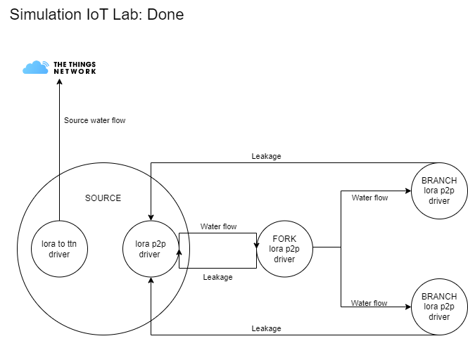
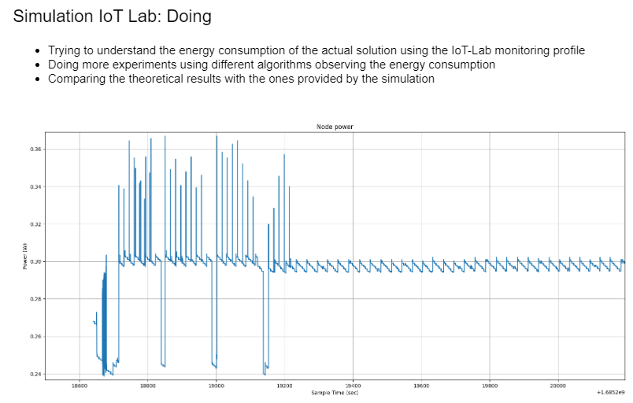
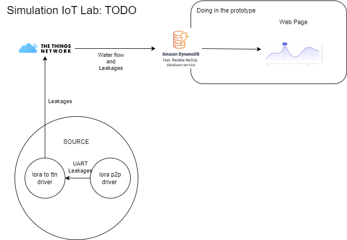

# Problems

## Simulation on IoT-Lab

### Goals

- Detect leakages in a distributed infrastructure.
- Use LoRa protocols to exchange messages.
- Run experiments with various algorithms to measure energy consumption using monitoring tools.

### Done

### Doing

### To Do

